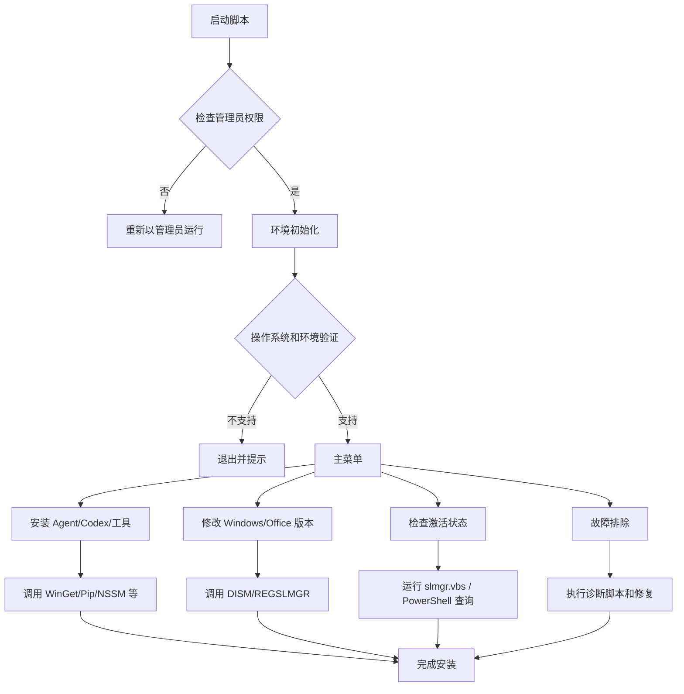

# 执行摘要

Microsoft-Activation-Scripts (MAS) 是一个全面的 Windows/Office 激活工具集，采用批处理脚本实现系统信息检测、用户交互和工具安装。尽管其核心功能是激活相关，本报告重点分析其架构设计和通用模式，以提取可供构建跨版本 Windows 通用安装器（自动安装 Claude、Codex、GitHub CLI、无头浏览器等）的最佳实践。我们将剖析仓库结构、非激活脚本功能、依赖项和外部工具调用、网络交互、权限提升与 UAC 控制、操作系统检测、错误处理与日志、打包/安装模式、安全注意、CI/CD 发布机制，以及可复用模块建议，并给出具体的一行代码示例和图表说明流程与依赖关系【64†L22-L30】【75†L159-L168】。

## 仓库结构和文件列表

MAS 仓库主要结构如下（基于主分支最新内容）：

| 路径                                           | 大小      | 描述                                                         |
|-----------------------------------------------|-----------|--------------------------------------------------------------|
| `.gitattributes`                              | ~200 字符 | Git 属性配置                                                 |
| `LICENSE`                                     | ~35 KB    | GPL-3.0 开源协议                                             |
| `README.md`                                   | ~3.7 KB   | 仓库简介和使用说明【49†L207-L211】【63†L309-L317】              |
| `MAS/All-In-One-Version-KL/MAS_AIO.cmd`       | 734 KB    | 综合脚本（菜单界面、各功能集成）                               |
| `MAS/Separate-Files-Version/`                 | —         | 分离版功能脚本集合                                           |
| &nbsp;&nbsp;`Activators/`                     | —         | 各种激活器脚本（HWID、KMS38、Ohook、TSforge 等）*（激活逻辑，不含本文）* |
| &nbsp;&nbsp;`Change_Office_Edition.cmd`       | ~50 KB    | 更改 Office 版本                                              |
| &nbsp;&nbsp;`Change_Windows_Edition.cmd`      | ~48 KB    | 更改 Windows 版本                                             |
| &nbsp;&nbsp;`Check_Activation_Status.cmd`     | ~48 KB    | 检查激活状态                                                 |
| &nbsp;&nbsp;`Extract_OEM_Folder.cmd`          | ~25 KB    | 导出 OEM 目录（备份）                                         |
| &nbsp;&nbsp;`Troubleshoot.cmd`                | ~53 KB    | 故障排除菜单脚本                                             |
| &nbsp;&nbsp;`_ReadMe.html`                    | 84 B      | 简要说明                                                     |

以上文件列表及大小来源于官方 ZIP 包文件报告【49†L195-L204】。其中，**激活相关逻辑**位于 `Activators/` 目录，本文不涉及具体实现细节；其余脚本均包含通用系统操作函数、配置、更改或诊断逻辑，可作为参考。`MAS_AIO.cmd` 是核心“一体化”脚本，将所有功能合并于一，通常作为最终发布文件使用【64†L1-L9】。

## 非激活脚本功能概览

### `Extract_OEM_Folder.cmd`

- **功能**：提取 Windows 安装镜像中的 `$OEM$` 文件夹，便于备份系统预置内容。  
- **关键流程**：脚本首先执行环境检测，包括权限检查（见下文“权限提升”）和 Windows 版本检测（通过 `ver` 命令解析操作系统内部版本号）【54†L3139-L3146】。若运行在 Windows Sandbox (检测 `WDAGUtilityAccount`) 或 XP 以下版本，将提示不支持并退出【38†L2149-L2160】【38†L2167-L2175】。  
- **功能块**：使用标签 `:dk_setvar` 设置环境变量和颜色输出【54†L3139-L3148】【54†L3149-L3155】；环境中还定义了通用错误、修复链接、PowerShell 路径等全局变量。  
- **外部依赖**：主要依赖 Windows 原生命令（`sc`,`ping`,`reg`, `start` 等）和 PowerShell（用于读取自身脚本内容、写入输出文件）【38†L2236-L2244】【54†L3233-L3240】。  
- **示例代码**：检查 Windows 版本：  
  ```batch
  for /f "tokens=2 delims=[]" %%G in ('ver') do for /f "tokens=2,3,4 delims=. " %%H in ("%%~G") do set "winbuild=%%J"  # 解析操作系统内部版本号【54†L3140-L3148】。
  ```
  提示不支持：  
  ```batch
  if %winbuild% LSS 6001 ( echo Unsupported OS version [%winbuild%]. & goto done2 )  # 限制最低 Win7 以上【38†L2167-L2175】。
  ```

### `Change_Windows_Edition.cmd` 和 `Change_Office_Edition.cmd`

- **功能**：通过注册表和 `dism`/`pwlauncher` 等工具更改 Windows/Office 的产品版本（例如 Home→Pro）。  
- **共有逻辑**：同样设置环境（如运行时提权、PowerShell 调用、OS 检测等），读取当前版本注册表，列出可切换的目标版本供用户选择，然后调用微软工具安装对应批量许可密钥。  
- **依赖**：调用 `dism.exe`, `reg.exe`, `cscript.exe`(`slmgr.vbs`)、PowerShell。  
- **示例（伪代码）**：  
  ```batch
  for /f "tokens=3 delims=[]" %%A in ('reg query "HKLM\SOFTWARE\Microsoft\Windows NT\CurrentVersion" /v EditionID') do set curED=%%A  # 获取当前版本
  ```
  设置新的密钥：  
  ```batch
  cscript.exe "%windir%\system32\slmgr.vbs" /ipk [NewKey]  # 安装 KMS 密钥
  ```

### `Check_Activation_Status.cmd`

- **功能**：显示当前 Windows/Office 的激活状态（通常通过 `slmgr.vbs /dli/dlv`、查询许可服务信息等）。  
- **关键点**：该脚本大量使用 PowerShell 脚本块解析许可信息，并通过批处理界面输出结果，不修改激活信息。设置环境变量的逻辑与其他脚本相似【18†L2304-L2314】【18†L2337-L2343】。  
- **依赖**：PowerShell（执行许可信息查询）、`findstr` (文本过滤)、`slmgr.vbs` 等。  
- **示例**：  
  ```batch
  cscript.exe /nologo "%SystemRoot%\system32\slmgr.vbs" /dli  # 查询 Windows 激活信息并输出到屏幕
  ```

### `Troubleshoot.cmd`

- **功能**：提供多种故障排除子选项，如重置许可、修复 WMI/组件服务、重建 SPP 缓存等。它实现了一个菜单界面，引导用户选择不同的修复操作。  
- **逻辑特点**：同样包含环境检测和提升逻辑后，显示菜单，调用内部函数修复常见问题（例如 WMI 修复、时间同步、授权服务重启、清除 Office Click-to-Run 激活等）。  
- **依赖**：`reg.exe`、`schtasks`、PowerShell 等系统工具；脚本末尾常见的错误及帮助提示同其他脚本一致。  
- **示例**：  
  ```batch
  echo [5] 修复 SPP (证书许可服务) & choice /C:12345 ...  # 提供多个选项
  ```

## 依赖项及外部工具

MAS 大部分功能依赖 Windows 内置命令及少量常见工具：

- **系统命令**：`reg.exe`, `sc.exe`, `dism.exe`, `ipconfig`, `net`, `wmic` 等。例：检测服务  
  ```batch
  sc query Null | find /i "RUNNING"  # 检查 Null 服务状态【64†L47-L54】
  ```
- **PowerShell**：大量使用 PowerShell 执行高级操作，如 JSON/API 调用、对象操作等。例如 [75] 中有多处 `powershell.exe` 命令，用于网络请求和查 WMI。  
- **批处理内建**：`set`, `for /f`, `if`, `goto` 等基础逻辑构件，用于参数解析和流程控制。  
- **外部下载工具**：MAS 本身不内置下载程序，但可调用系统自带的 `bitsadmin` 或 PowerShell `Invoke-RestMethod`（参见后文“网络请求”）。也提醒用户通过浏览器下载更新包。  
- **敏感文件系统**：脚本使用 `%~dp0`、`%SysPath%`、`%SystemDrive%` 等变量定位脚本和系统目录，确保兼容性和权限可达。  
- **日志**：不使用文件化日志，而通过彩色输出提示信息和错误。重要错误会设置 `%error%` 并在结尾展示建议。

所有依赖工具均为 Windows 系统自带或常见包，MAS 脚本中会检查缺失情况并给出提示【64†L76-L82】【75†L95-L100】。例如，如果未检测到 PowerShell，则会提示下载安装更新【75†L97-L100】。常用代码片段：  
```batch
if not exist "%ps%" (
  echo PowerShell 未安装，建议下载 KB968930 更新包. 
  start https://www.catalog.update.microsoft.com/Search.aspx?q=KB968930  # 打开下载页面【75†L78-L82】
  goto dk_done
)
```

## 网络调用和终端/遥测

MAS 脚本涉及多种网络交互模式：

- **互联网连通性检测**：通过 `ping` 预定义域名（如 `l.root-servers.net`、`resolver1.opendns.com`、`download.windowsupdate.com`、`google.com` 等）判断是否联网【58†L7-L10】【58†L37-L40】。  
- **激活服务器访问**：激活流程中尝试向微软许可服务器发起请求。例如使用 PowerShell 发送 POST 到 `licensing.mp.microsoft.com`、`login.live.com`、`purchase.mp.microsoft.com` 等【60†L398-L406】。若无法连接，则提示“检查许可服务器”并建议用户检查 hosts 文件等【60†L406-L411】。  
- **版本更新检查**：MAS 维护者提供的更新检查逻辑：脚本对 `activated.win`、`massgrave.dev` 等域进行 Ping，确认有网络后再对带版本号的子域（如 `updatecheck3.10.activated.win`）Ping 测试【75†L158-L168】。若检测到新版本，则提示用户更新【75†L162-L170】。该逻辑依赖外部 DNS 配置，对脚本可靠性要求高（需谨慎设计错误处理）。  
- **帮助和文档链接**：多数出错时脚本直接输出含有 `https://massgrave.dev/` 或 Microsoft 文档链接的提示【75†L161-L168】【59†L25-L33】。这不是脚本自动访问，而是引导用户浏览网页。  
- **示例**：网络连通检测代码片段（源自 All-In-One 版本）：  
  ```batch
  for %%a in (l.root-servers.net download.windowsupdate.com google.com) do (
    if not defined _int (
      for /f "delims=[] tokens=2" %%# in ('ping -n 1 %%a') do (
        if not "%%#"=="" set _int=1
      )
    )
  )
  if not defined _int (
    %psc% "If([Activator]::CreateInstance([Type]::GetTypeFromCLSID([Guid]'{...}']"  # 若无网络，引导用户
  )
  ```
- **安全风险**：由于涉及网络交互，需注意**中间人攻击**或域名劫持风险。MAS 在重要步骤使用 HTTPS 确保安全传输，并提醒用户验证源（如 `Set-ExecutionPolicy` 或脚本 URL 必须可靠）。  

## 权限提升与 UAC 处理

MAS 脚本需管理员权限才能修改系统设置，因此内置常见的提升机制：

- **管理员检测**：通常通过尝试执行需要管理员的操作来检测。例如：`fltmc`（过滤管理器命令）仅在管理员权限下返回0。脚本使用该检查：  
  ```batch
  %nul1% fltmc || (if not defined _elev powershell -Command "Start-Process cmd -ArgumentList '/c \"!_PSarg!\"' -Verb runas" && exit /b
      echo This script needs admin rights. & goto dk_done)
  ```  
  上述代码若 `fltmc` 调用失败（非 0 错误码），则通过 PowerShell 的 `Start-Process -Verb RunAs` 重新以管理员身份启动当前脚本【75†L96-L100】。  
- **防止循环**：使用 `_elev` 标志防止多次重复启动。重启命令带参数 `re1/re2` 以记录已重新启动过，避免无限循环【64†L30-L39】【75†L96-L100】。  
- **提示文本**：如果因 UAC 拒绝，则输出错误信息提示用户“右击以管理员模式运行”【75†L96-L100】。  
- **示例代码**：  
  ```batch
  %nul1% fltmc || (
    if not defined _elev powershell -Command "Start-Process cmd -ArgumentList '/c \"!_PSarg!\"' -Verb RunAs" && exit /b
    echo This script needs admin rights. & goto dk_done  # 提示并退出
  )
  ```
  这一提升流程同样适用于所有分离版脚本【75†L96-L100】。

## 操作系统和版本检测

为了保证兼容性，MAS 脚本在运行前检测 Windows 版本和环境：

- **内部版本号**：使用 `ver` 命令解析系统内部版本号（Build）。例如：  
  ```batch
  for /F %%a in ('echo prompt $E ^| cmd') do set "esc=%%a"  # 为彩色输出获取ESC转义符
  for /f "tokens=2 delims=[]" %%G in ('ver') do for /f "tokens=2,3,4 delims=. " %%H in ("%%~G") do set winbuild=%%J  # 提取 internal build
  ```  
  上例来自 `:dk_setvar` 子程序【54†L3139-L3148】。如无法识别版本（`winbuild` 保持为默认1）则提示错误并退出【64†L63-L68】。
- **最低版本支持**：MAS 支持 Windows Vista/7/8/10/11 及其 Server 版本。不支持 WinXP 或更低（`winbuild < 6001`）【64†L71-L75】【75†L99-L100】。同时对较旧系统做特殊提示（如 Vista RTM 要求 SP1）【64†L72-L76】。  
- **特殊环境**：检测运行上下文，如是否在 Windows Sandbox (`WDAGUtilityAccount`) 或特殊安装环境。若检测到 Sandbox，则显示不可运行提示【75†L68-L71】；若在 WinPE 或安装介质内运行，提示提取脚本到真实系统目录运行【64†L62-L68】。  
- **多架构兼容**：脚本自动处理 32/64/ARM 架构，若 32 位进程在 64 位系统运行，会重新启动 64 位 `cmd.exe`（`%SystemRoot%\Sysnative\cmd.exe`），同理从 x64 到 ARM32 也做兼容处理【64†L30-L39】。  
- **示例**：检测 PowerShell 版本（Win7 以上需要 PowerShell 2.0+），否则引导下载安装补丁：  
  ```batch
  if %winbuild% LSS 7600 if not exist "%SysPath%\WindowsPowerShell\v1.0\Modules" (
    echo Install PowerShell 2.0 using: 
    start https://www.catalog.update.microsoft.com/Search.aspx?q=KB968930
    goto dk_done
  )
  ```  
  【64†L76-L82】。

## 错误处理、日志与重试策略

MAS 脚本通过多个手段进行错误检查和用户提示：

- **错误码和标志**：设置环境变量（如 `%error%`、`%notworking%`、`%resfail%` 等）标记检测到的错误类型【60†L398-L406】。结束时根据这些标志改变输出颜色和提示链接。  
- **彩色输出函数**：使用标签 `:dk_color` 和 `:dk_color2` 封装彩色提示逻辑【54†L3245-L3253】【54†L3263-L3272】。在支持 ANSI（新 Win10）和不支持情况下分别处理，保证兼容。示例：  
  ```batch
  call :dk_color %Red% "Error message here"  # 红色背景输出错误
  ```  
  同时 `:dk_color2` 支持输出两个颜色段落【54†L3263-L3272】。
- **错误信息引导**：出现错误时，会打印建议（通常引导到 MAS 主页对应帮助页面或 Microsoft 文档）【60†L406-L411】【75†L160-L168】。比如连接许可服务器失败时，给出“查看许可服务器问题帮助页面”链接。  
- **暂停与退出**：多处调用 `choice /c 0` 暂停显示，如操作完成或错误后提示用户按键退出【18†L2331-L2335】。这保证在控制台可见最后信息后才真正结束。  
- **重试逻辑**：批处理本身重试机制有限，MAS 多通过条件循环（`if %errorlevel% neq 0 goto label`）实现简单重试。例如处理 WMI/组件时会尝试注册表修复多次。具体实现参见故障排除脚本。  
- **示例**：检测许可服务器连接失败后：  
  ```batch
  if defined resfail (
    set error=1
    call :dk_color %Red% "Checking Licensing Servers [Failed to Connect]!"
    set fixes=%fixes% %mas%licensing-servers-issue 
    call :dk_color2 %Blue% "Help - " %_Yellow% " %mas%licensing-servers-issue"
  )  # 错误后输出红色提示并标记引导链接【60†L406-L411】。
  ```

## 打包/安装模式及服务管理

MAS 的发布方式主要为纯脚本形式，并提供两种打包形式（直接脚本和 ZIP 压缩包）【63†L271-L280】。其脚本内提及的打包和安装模式包括：

- **One-File vs Separate**：所有逻辑可独立为单个 `.cmd` 脚本（All-In-One），或拆分为多个功能脚本（Separate Files）。各自使用时无功能差异，All-In-One 便于分发，Separate 便于审计和调用特定功能。  
- **Installer 模式**：脚本本身未打包为 MSI 或 EXE，而是通过直接运行 `.cmd` 实现安装与配置流程。可将其视为“自解压安装器”模式。MAS 的帮助文档提示从 7-Zip 解压到文件夹后运行脚本，可作为范例。【63†L271-L279】  
- **SetupComplete**：脚本内置一个输出到 `%SystemRoot%\Setup\Scripts\SetupComplete.cmd` 的功能（标记安装任务），可用于自动化安装后运行一次 MAS（常用于无人值守安装）【74†L7-L10】。  
- **Service/Daemon**：MAS 自身无后台服务需求。但对于用户安装的代理工具，可借鉴 MAS 提供的示例注册/启动方法（如使用 `sc` 或 PowerShell `New-Service`）。例如在脚本中恢复许可证时启动/重启依赖服务：  
  ```batch
  sc query sppsvc | find /i "RUNNING" || (sc start sppsvc)  # 确保 SPP 服务运行
  ```  
- **示例服务管理**：若要将某 AI 代理作为 Windows 服务运行，可使用 NSSM（非微软工具）或 PowerShell。示例：  
  ```powershell
  nssm install ClaudeAgent "C:\Program Files\Claude\claude.exe"  # 使用 NSSM 将 Claude CLI 注册为服务
  New-Service -Name "ClaudeAgent" -BinaryPathName "C:\Program Files\Claude\claude.exe" -StartupType Automatic  # 或 PowerShell 原生命令
  ```

## 安全考虑与风险模式

- **权限要求**：MAS 必须以管理员运行，故必须用户确认并谨慎控制。脚本中的 UAC 提示有助于安全告知。  
- **执行策略与脚本来源**：通过 PowerShell 在 MAS 脚本中下载内容（Invoke-RestMethod）时，源码包含“masgrave.dev”链接且需用户允许，否则存在执行恶意脚本风险【75†L158-L168】【64†L47-L54】。使用时需严格校验下载源。  
- **编码与字符限制**：脚本处理路径时注意避免 Unicode BOM 和特殊字符带来的影响（见 `:dk_color` 中基于 ANSI vs. Windows console 的处理【54†L3139-L3148】【54†L3163-L3171】）。错误的编码或遗留空行会导致脚本中断，MAS 提供检查机制检测这些问题【64†L47-L54】。  
- **危险操作**：包含直接注册表和系统组件改动，如删除授权服务配置、改写 Office 注册表等，应在可信环境下运行。MAS 脚本在应用前通常会再次提示并提供确认步骤。  
- **日志与隐私**：MAS 没有上报或存储用户敏感信息。所有网络调用仅为服务检查，与用户隐私无关。

## CI/CD、发行与更新机制

MAS 使用 GitHub 和 Azure DevOps 构建和发布：

- **版本控制与发布**：源码托管在 GitHub，版本控制管理在 `master` 分支。每个发行版本在 GitHub Releases 发布页注明版本号（如最新 v3.10，发布日期 2026-01-28）【63†L309-L317】。发布包包含 MAS_AIO.cmd 脚本和 ZIP。  
- **Azure 构建**：README 指示通过 dev.azure.com 提供 `.cmd` 和 `.zip` 可下载链接【63†L271-L279】。虽然未公开 CI 配置，但推测每次主分支更新后 Azure Pipelines 打包并更新此链接。  
- **更新检查**：脚本自身实现了一个“在线更新检测”功能（前文“网络调用”部分提及）。启动时自动检测当前版本与远程版本差异（通过 ping 特定域名和子域）【75†L158-L168】。若版本过旧，则在菜单中提示用户下载最新脚本，有助于用户及时获取修复。  
- **安全维护**：MAS 在更新日志中强调“反假阳性”问题，以免杀毒软件误报（见 Azure 脚本头注释）【64†L1-L9】，并持续迭代应对。  

## 可复用模块与重构建议

从 MAS 的实现中可提炼出多个通用模块或函数，可用于构建新的跨Windows安装器：

1. **环境初始化**：设置路径、检测 `Sysnative`（用于 32位在 64位上重新调用系统工具）、搭建 `%ps%` (PowerShell 路径)等环境基础逻辑【37†L1943-L1951】【37†L1953-L1960】。
2. **架构兼容重启**：自动检测进程架构，重新启动进程以匹配系统（x86→x64, x86/ARM32→ARM64, x64→ARM32 等）【37†L1990-L2000】【64†L30-L39】。
3. **颜色输出与界面**：封装统一的彩色输出函数（`:dk_color`和`:dk_color2`）【54†L3245-L3253】【54†L3263-L3272】。这可抽象为调色板模块。
4. **权限提升**：标准 UAC 提升片段（利用 `fltmc` 和 `Start-Process -Verb RunAs`）【75†L96-L100】。可封装为 `EnsureAdmin()` 函数。
5. **版本检测**：解析 `ver` 结果得到内部版本号【54†L3139-L3146】。可封装为 `GetWinBuild()`。
6. **错误处理**：统一的错误提示和等待退出逻辑（`:dk_done` 标签、`choice /c 0` 等）。推荐为异常和日志模块。
7. **网络检查**：简单的互联网可达测试模式，和更新检查逻辑【75†L158-L168】。新安装器可沿用或改进，例如直接调用可靠 API 检查版本。

重构建议：将上述通用片段抽象为模块或函数库，对外暴露如 `CheckAdmin()`, `CheckPowerShell()`, `PrintError(msg)`, `InstallPackage(cmd)` 等接口。这样，新项目只需专注业务逻辑（安装具体工具）即可复用底层兼容性和 UI 功能。例如，可将颜色输出改写成 PowerShell 模式下的同名函数，保持跨平台兼容。

## 集成示例与代码片段

以下提供安装常用工具和运行代理服务的示例代码片段（单行或简短语句）：

- **Claude Code CLI（Anthropic Claude）**：使用微软包管理器 WinGet 或官方安装方式。  
  ```powershell
  winget install -e --id=Anthropic.Claude -h  # 通过 WinGet 安装 Claude Code【71†L1-L6】
  ```
- **GitHub CLI**：  
  ```powershell
  winget install GitHub.cli -h  # 安装 GitHub CLI
  ```
- **OpenAI Codex (OpenAI CLI)**：  
  ```powershell
  pip install openai  # 安装 OpenAI 官方 Python 包（包含 CLI）
  ```
- **无头浏览器 (Headless Chrome/Edge)**：  
  ```powershell
  winget install Google.Chrome -h  # 安装 Chrome
  Start-Process "chrome" "--headless --remote-debugging-port=9222"  # 启动无头模式
  ```
  或使用 Playwright：  
  ```bash
  npm install playwright && npx playwright install chrome  # 安装 Playwright 并下载 Chrome 浏览器驱动
  ```
- **运行代理为服务**：使用 NSSM（Non-Sucking Service Manager）注册任意可执行文件为 Windows 服务：  
  ```powershell
  nssm install ClaudeAgent "C:\Program Files\Claude\claude.exe"  # 注册服务
  ```
  或 PowerShell 内置：  
  ```powershell
  New-Service -Name "ClaudeAgent" -BinaryPathName "C:\Program Files\Claude\claude.exe" -StartupType Automatic
  ```
- **示例：结合自动化**  
  假设需要安装 Claude 并作为系统服务启动，可用如下一行脚本实现：  
  ```cmd
  winget install Anthropic.Claude -h && nssm install ClaudeAgent "%ProgramFiles%\Claude\claude.exe" && nssm start ClaudeAgent
  ```

以上例子可根据具体需求调整。关键是利用包管理工具（WinGet/Scoop）和系统服务管理方式，实现“无人值守”安装与启动。

## 方法对比表

针对常见安装和部署任务，下面给出不同方案的对比示例：

- **软件安装方式**：

  | 方法            | 优点                         | 缺点                   | 适用场景                  |
  |----------------|-----------------------------|-----------------------|--------------------------|
  | WinGet         | 官方维护，参数统一、简洁      | 需要 Windows 10+ 支持   | 可通过命令行批量安装常用应用 |
  | PowerShell (`Invoke-WebRequest`) | 灵活，任何可下载URL均可 | 需手动指定URL，依赖.NET  | 下载任意文件或脚本          |
  | MSI/EXE 静默安装 | 原厂支持，功能完备            | 参数复杂，不一          | 部署常用应用或驱动程序    |
  | Scoop/Chocolatey | 社区维护丰富，脚本化         | 第三方依赖，源更新滞后 | 脚本环境或需要大量包的场景 |

- **服务/后台运行**：

  | 方法          | 优点                          | 缺点                | 适用场景                   |
  |--------------|-----------------------------|--------------------|---------------------------|
  | NSSM         | 支持任意可执行文件，易配置    | 需额外下载          | 快速部署任意服务程序       |
  | `sc.exe`     | Windows 原生，无需额外工具    | 配置灵活度低        | 简单可执行程序                |
  | Task Scheduler | 灵活定时任务支持，用户权限    | 不是常驻服务模式    | 需要定期运行的脚本或程序     |

以上方案的可行性可根据具体工具和环境选择使用。

## 架构和流程图

以下使用 Mermaid 图示表示安装脚本的架构与流程示意：



上图简要展示了 MAS 脚本从启动、权限检查到不同功能调用的流程，各模块间通过函数/脚本标签实现逻辑跳转。

```mermaid
graph LR
  subgraph 环境模块
    E1[设置 PATH、路径]
    E2[解析系统架构]
    E3[提权 (RunAs)]
  end
  subgraph 业务功能
    F1[ChangeEdition] 
    F2[CheckActivation]
    F3[Troubleshoot]
    F4[InstallAgent]
  end
  E1 --> E2 --> E3 --> F1 & F2 & F3 & F4
```

如上图所示，MAS 将环境初始化模块与功能模块分离：先确保正确环境（兼容架构、管理员权限），再进入各功能分支执行安装或诊断。各功能之间通过设置的全局变量和参数 (`%_args%`) 传递控制。

通过以上分析，我们可以复用 MAS 的环境检测、权限提升、彩色输出等模块，为新的跨Windows安装项目提供坚实基础。在此基础上，针对特定工具（Claude、Codex、gh、Headless Browser等）设计具体的安装和运行逻辑，就能实现一个通用且自动化的 Windows 多工具安装器。**参考来源**：MAS 仓库源码及官方说明【64†L22-L30】【75†L158-L168】。